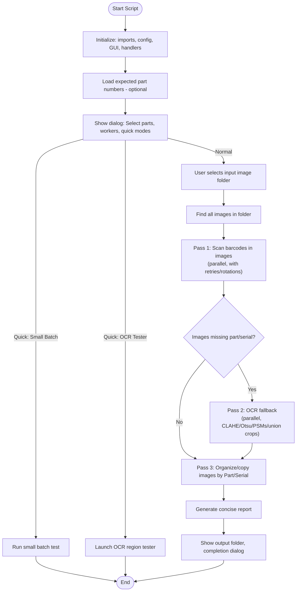

# Barcode Sorter

Organizes photos automatically by extracting Part Numbers (pattern `P####-#####`) and Serial Numbers (`S900` + 15 digits) from barcodes. Falls back to OCR if barcodes are weak.

**Getting Started:** Download `Packaging Photo Sorter.zip` from the [latest release](https://github.com/matthewsolc66/Barcode-Reading/releases/latest) and extract it to wherever you want to keep the script files.

## What You Need
- Visual C++ Redistributable (x64) — required for `pyzbar` barcode decoding:
  https://www.microsoft.com/en-us/download/details.aspx?id=40784
- Python 3.12+ (64-bit)
- Optional: Tesseract-OCR (improves salvage when barcode data is incomplete):
  https://github.com/UB-Mannheim/tesseract/wiki

## First-Time Setup (Windows)
1. Install the VC++ runtime (link above).
2. Run the setup script in this folder:
   ```powershell
   .\setup_windows.bat
   ```
   Creates `.venv` and installs: Pillow, pyzbar, opencv-python, numpy, pytesseract, psutil (or from `requirements.txt`).
3. On success the window pauses so you can review output.

## Running the Sorter
Preferred (double-click or from CMD):
```cmd
run_sorter.bat
```
Manual PowerShell:
```powershell
.\.venv\Scripts\Activate.ps1
python .\Barcode_Sorter_RC1.py
```

## Step-by-Step Workflow
1. Start `run_sorter.bat`.
2. Dialog: choose the input image folder.
3. Script enumerates supported image files.
4. Barcode Passes: multiple enhancement + rotation attempts to read part & serial quickly.
5. Missing data? OCR fallback activates (candidate crops, CLAHE + Otsu, multiple PSM modes, union zoom regions).
6. OCR Cleaning: normalizes noisy characters (O→0, I→1, etc.), applies regex extraction for part/serial patterns.
7. Validation: ensures part format `P####-#####`; serial prefix `S900` + 15 digits (week/year sanity checks may be applied internally).
8. Output: creates `Sorted_Images/<Part>/<Serial>/` and copies images there.
9. Report: summary file lists totals and any unresolved images (if implemented).
10. Completion: final counts shown; window pauses (batch mode) so you can read results.

## Optional Configuration
- `part_numbers_config.txt`: one part number per line to reinforce recognition.
- `ocr_region_tester.py`: tuning tool for OCR extraction (not needed for normal use).
- Debug crops can be enabled in the script if you toggle the internal debug flag (kept off by default in distribution for cleanliness).

## Useful Files
- `Barcode_Sorter_RC1.py` – main logic (barcode passes, OCR fallback, organization)
- `setup_windows.bat` – environment + dependency setup
- `run_sorter.bat` – activates `.venv` and runs sorter
- `requirements.txt` – pinned dependencies
- `ocr_region_tester.py` – interactive OCR crop tester
- `part_numbers_config.txt` – optional known part list

## Photo Capture Best Practices

For best barcode detection results:

**Camera Angle (Critical)**
- Position camera perpendicular (90°) to the label surface
- Avoid angled shots which distort barcode lines


**General Guidelines**
- Ensure label is fully visible and in frame
- Avoid blur (hold steady or increase lighting)
- Adequate lighting (no harsh shadows or glare)
- Label should fill reasonable portion of frame

## Troubleshooting
- Barcode import error (`pyzbar` / missing DLL): reinstall VC++ runtime and reboot if needed.
- No OCR output: install Tesseract-OCR (UB Mannheim build) and ensure `tesseract.exe` on PATH — download:
  https://github.com/UB-Mannheim/tesseract/wiki
- Install failures in setup: rerun as Administrator or manually run the printed `pip install` line.

If none of these resolve the issue, please create an issue at https://github.com/matthewsolc66/Barcode-Reading and the developer will try to help as soon as possible.

## Workflow Diagram



