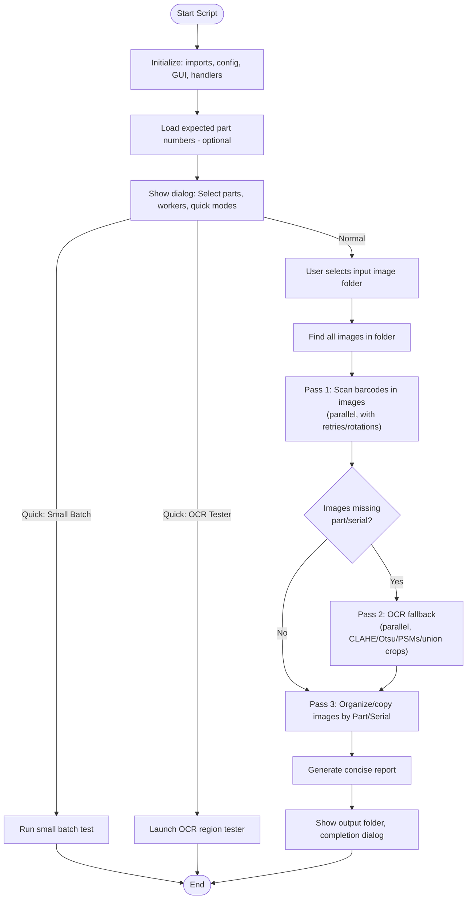

# Barcode Sorter

Simple image sorter that scans images for Part Numbers (P####-#####) and Serial Numbers (S900...) and organizes images into `Sorted_Images/`.

## Prerequisites (Windows)

- Microsoft Visual C++ Redistributable (x64) — REQUIRED for `pyzbar` on Windows:
  https://www.microsoft.com/en-us/download/details.aspx?id=40784&msockid=2027dabdab8d696a3192ccf8aa2068d3

- Python 3.12+ (64-bit) — The included `setup_windows.bat` will install Python if missing.

- (Optional, for OCR) Tesseract-OCR — install to enable OCR fallback:
  https://github.com/UB-Mannheim/tesseract/wiki

## Quick setup (Windows)

1. Install the Visual C++ Redistributable (x64) from the link above (required by `pyzbar`).

2. In this project folder, run the setup script to install Python (if missing), create a virtual environment, and install dependencies:

```powershell
.\setup_windows.bat
```

This will create a `.venv` folder and install these Python packages:
- Pillow
- pyzbar
- opencv-python
- numpy
- pytesseract
- psutil

If `requirements.txt` is present, the script installs from it.

3. Run the sorter using the helper script (activates venv if present):

CMD:
```cmd
run_sorter.bat
```

PowerShell (activate manually or use `run_sorter.bat`):
```powershell
.\.venv\Scripts\Activate.ps1
python .\Barcode_Sorter_RC1.py
```

## Useful files

- `Barcode_Sorter_RC1.py` — main script (three-pass: barcode scan, OCR fallback, organize)
- `setup_windows.bat` — Windows setup script (installs Python, creates venv, installs pip deps)
- `requirements.txt` — Python dependency list
- `run_sorter.bat` — convenience runner that activates `.venv` and runs the sorter
- `ocr_region_tester.py` — interactive ROI OCR tester (useful during tuning)
- `part_numbers_config.txt` — optional whitelist of expected part numbers

## Troubleshooting
If none of these resolve the issue, please create an issue at https://github.com/matthewsolc66/Barcode-Reading and the developer will try to help as soon as possible.

 
- If you see an import error for `pyzbar` mentioning `MSVCP*.dll` or `VCRUNTIME*.dll`:
  - Install the Microsoft Visual C++ Redistributable (x64) (link above) and reboot.

- If OCR isn't working (no `pytesseract` import error or empty OCR results):
  - Install Tesseract-OCR (UB-Mannheim build recommended for Windows). Make sure its `tesseract.exe` is on `PATH`, or set `TESSDATA_PREFIX` appropriately.

- If package installation fails during `setup_windows.bat`:
  - Try running the script as an administrator, or open a PowerShell prompt with admin rights and rerun the `pip install` line manually.

 
## Workflow Diagram



